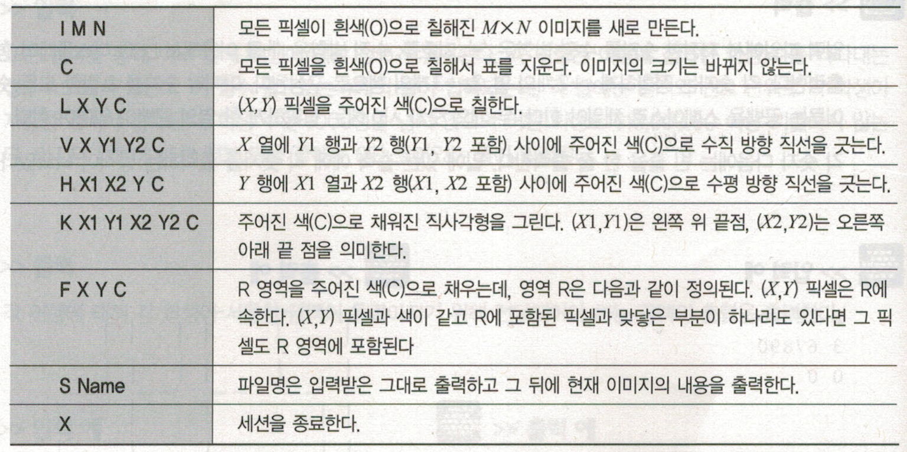

# Algorithm
- 참고도서  

- 사용한언어  

   
   
   
   
   

- 문제 1 [Java]
   
   * 3n + 1 문제
   * 두개를 입력받아 두개의 사이값 중 수열을 만들고 그 수열의 사이클중 가장 큰 값을 찾아내는 문제이다.   
   * 수열만드는 방법 : 어떤수의 값이 짝수면 2로 나누고 홀수면 3을 곱한다음 1을 더한다. 맨마지막수가 1이 될때까지 반복하며, 반복된수의 횟수는 사이클아라고 부른다.    
<table>
   <tr>
         <td>
            입력
         </td>
         <td>
            출력
         </td>
   </tr>
   <tr>
         <td>
            1 10
         </td>
         <td>
            20
         </td>
   </tr>      
</table>
- 문제 2 [Swift]
   
   * 지뢰찾기 문제  
   * 별표는 지뢰이며, .는 없는 표시다. 
<table>
   <tr>
         <td>
            입력
         </td>
         <td>
            출력
         </td>
   </tr>
   <tr>
         <td>
            4 3  
            *... 
            .... 
            .*.. 
         </td>
         <td>
            *100 
            2210 
            1*10 
         </td>
   </tr>      
</table>
- 문제 3 [Kotlin]
   
   * 여행경비지출 문제  
   * 어떤 모임에서 여행경비를 지출하는 방법으로 식비, 숙박비, 교통비등... 을 각자 내고 나중에 모든 액수를 동일하게 맞추기 위해 추가된 돈을 1/n로 나누어 주었다. 나누어준 금액을 구하라 
<table>
   <tr>
         <td>
            입력
         </td>
         <td>
            출력
         </td>
   </tr>
   <tr>
         <td>
            3  
            10.00 
            20.00 
            30.00 
         </td>
         <td>
            10.00 
         </td>
   </tr>      
</table>
- 문제 4 [Javascript]
   
   * LCD 전광판 문제  
   * 숫자를 전광판에 표시한다. 
   * 첫번째 입력값은 크기 두번째 입력값은 표시될 숫자이다.
<table>
   <tr>
         <td>
            입력
         </td>
         <td>
            출력
         </td>
   </tr>
   <tr>
         <td>
            2 123
         </td>
         <td>
           <pre>
   - -  - - 
|     |    |
|     |    | 
   - -  - - 
| |        |
| |        |
   - -  - - 
           </pre>
         </td>
   </tr>      
</table>
- 문제 5 [Python]
   
   * 그래픽 편집기 문제  
   * 입력은 한 줄에 하나씩의 편집기 명령으로 구성된다. 각 명령은 줄 맨 앞에 있는 대문자 한 개로 표현된다. 
     매개변수가 필요한 경우에는 그 명령과 같은 줄에 스페이스로 분리되어 매개변수가 입력된다. 
     픽셀 좌표는 1이상 M이하의 열 번호와 1이상 N이하의 행번호, 이렇게 두개의 정수로 표현되며 이때 
     1 <= M, N <= 250라는 조건이 만족된다. 표의 왼쪽 위 꼭지점을 원점으로 삼는다. 색은 대문자로 지정된다. 
     편집기에서 받아들이는 명령은 다음과 같다. 
     
<table>
   <tr>
         <td>
            입력
         </td>
         <td>
            출력
         </td>
   </tr>
   <tr>
         <td>
           <pre>
I 5 6
F 3 3 J
V 2 3 4 W
H 3 4 2 Z
S one.bmp
X
           </pre>
         </td>
         <td>
           <pre>
one.bmp
JJJJJ
JJZZJ
JWJJJ
JWJJJ
JJJJJ
JJJJJ
           </pre>
         </td>
   </tr>      
</table>
- 문제 6 [Java]
   
   * 인터프리터 문제  
   * 최초 case별(그룹별)로 몇개를 입력받는지 선택한다.
   * 명령어는 총 1000개의 메모리 공간을 같는다.
   * 예를 들어 두개의 case는  총 2000개의 메모리 공간을 받게 된다.
<table>
   <tr>
         <td>
            입력
         </td>
         <td>
            출력
         </td>
   </tr>
   <tr>
         <td>
            <pre>
1 

299
492
495
399
100
000
000
.
.
.
.
            </pre>
         </td>
         <td>
           <pre>
7
           </pre>
         </td>
   </tr>      
</table>
- 문제 7  
   * 체스 체크확인 문제  
<table>
   <tr>
         <td>
            입력
         </td>
         <td>
            출력
         </td>
   </tr>
   <tr>
         <td>
            <pre>
..k.....
ppp.pppp
........
.R...B..
........
........
PPPPPPPP
K.......
            </pre>
         </td>
         <td>
           <pre>
Check in
           </pre>
         </td>
   </tr>      
</table>
- 문제 8  
   * 호주식 투표법 문제  