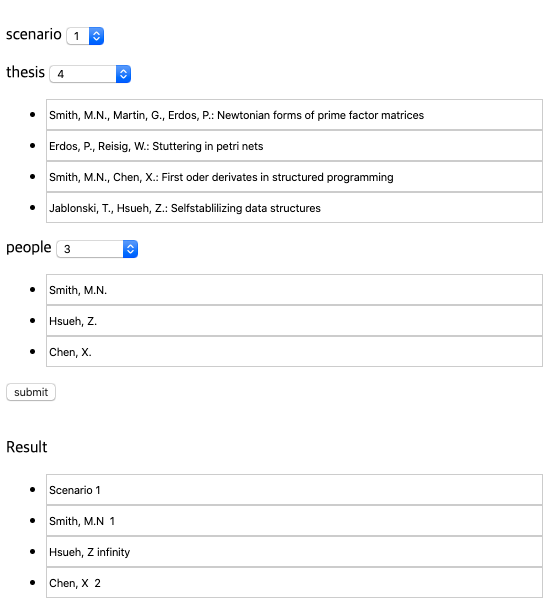

# Algorithm
- 참고도서  

- 사용한언어  

   
   
   
   
   

- 문제 1 [Java] <a href="https://github.com/leeyonghe/Algorithm/tree/master/Question_01">Go</a>
   
   * 3n + 1 문제
   * 두개를 입력받아 두개의 사이값 중 수열을 만들고 그 수열의 사이클중 가장 큰 값을 찾아내는 문제이다.   
   * 수열만드는 방법 : 어떤수의 값이 짝수면 2로 나누고 홀수면 3을 곱한다음 1을 더한다. 맨마지막수가 1이 될때까지 반복하며, 반복된수의 횟수는 사이클아라고 부른다.    
<table>
   <tr>
         <td>
            입력
         </td>
         <td>
            출력
         </td>
   </tr>
   <tr>
         <td>
            1 10
         </td>
         <td>
            20
         </td>
   </tr>      
</table>
- 문제 2 [Swift] <a href="https://github.com/leeyonghe/Algorithm/tree/master/Question_02">Go</a>
   
   * 지뢰찾기 문제  
   * 별표는 지뢰이며, .는 없는 표시다. 
<table>
   <tr>
         <td>
            입력
         </td>
         <td>
            출력
         </td>
   </tr>
   <tr>
         <td>
            4 3  
            *... 
            .... 
            .*.. 
         </td>
         <td>
            *100 
            2210 
            1*10 
         </td>
   </tr>      
</table>
- 문제 3 [Kotlin] <a href="https://github.com/leeyonghe/Algorithm/tree/master/Question_03">Go</a>
   
   * 여행경비지출 문제  
   * 어떤 모임에서 여행경비를 지출하는 방법으로 식비, 숙박비, 교통비등... 을 각자 내고 나중에 모든 액수를 동일하게 맞추기 위해 추가된 돈을 1/n로 나누어 주었다. 나누어준 금액을 구하라 
<table>
   <tr>
         <td>
            입력
         </td>
         <td>
            출력
         </td>
   </tr>
   <tr>
         <td>
            3  
            10.00 
            20.00 
            30.00 
         </td>
         <td>
            10.00 
         </td>
   </tr>      
</table>
- 문제 4 [Javascript] <a href="https://github.com/leeyonghe/Algorithm/tree/master/Question_04">Go</a>
   
   * LCD 전광판 문제  
   * 숫자를 전광판에 표시한다. 
   * 첫번째 입력값은 크기 두번째 입력값은 표시될 숫자이다.
<table>
   <tr>
         <td>
            입력
         </td>
         <td>
            출력
         </td>
   </tr>
   <tr>
         <td>
            2 123
         </td>
         <td>
           <pre>
   - -  - - 
|     |    |
|     |    | 
   - -  - - 
| |        |
| |        |
   - -  - - 
           </pre>
         </td>
   </tr>      
</table>
- 문제 5 [Python] <a href="https://github.com/leeyonghe/Algorithm/tree/master/Question_05">Go</a>
   
   * 그래픽 편집기 문제  
   * 입력은 한 줄에 하나씩의 편집기 명령으로 구성된다. 각 명령은 줄 맨 앞에 있는 대문자 한 개로 표현된다. 
     매개변수가 필요한 경우에는 그 명령과 같은 줄에 스페이스로 분리되어 매개변수가 입력된다. 
     픽셀 좌표는 1이상 M이하의 열 번호와 1이상 N이하의 행번호, 이렇게 두개의 정수로 표현되며 이때 
     1 <= M, N <= 250라는 조건이 만족된다. 표의 왼쪽 위 꼭지점을 원점으로 삼는다. 색은 대문자로 지정된다. 
     편집기에서 받아들이는 명령은 다음과 같다. 
     
<table>
   <tr>
         <td>
            입력
         </td>
         <td>
            출력
         </td>
   </tr>
   <tr>
         <td>
           <pre>
I 5 6
F 3 3 J
V 2 3 4 W
H 3 4 2 Z
S one.bmp
X
           </pre>
         </td>
         <td>
           <pre>
one.bmp
JJJJJ
JJZZJ
JWJJJ
JWJJJ
JJJJJ
JJJJJ
           </pre>
         </td>
   </tr>      
</table>
- 문제 6 [Java] <a href="https://github.com/leeyonghe/Algorithm/tree/master/Question_06">Go</a>
   
   * 인터프리터 문제  
   * 최초 case별(그룹별)로 몇개를 입력받는지 선택한다.
   * 명령어는 총 1000개의 메모리 공간을 같는다.
   * 예를 들어 두개의 case는  총 2000개의 메모리 공간을 받게 된다.
<table>
   <tr>
         <td>
            입력
         </td>
         <td>
            출력
         </td>
   </tr>
   <tr>
         <td>
            <pre>
1 

299
492
495
399
100
000
000
.
.
.
.
            </pre>
         </td>
         <td>
           <pre>
7
           </pre>
         </td>
   </tr>      
</table>
- 문제 7 [Swift] <a href="https://github.com/leeyonghe/Algorithm/tree/master/Question_07">Go</a>
   
   * 체스 체크확인 문제  
   * 입력시 체스판 전체의 위치를 넣는다. .는 빈공간이고 나머지는 아래와 같이 약어로 각 체스말을 표시한다. 각 말에 대한 상세한 설명은 제외한다.  
      * k : King  
      * q : Queen  
      * n : Knight  
      * b : Bishop  
      * r : Rook  
      * p : Pawn  
   * 소문자는 내 팀이고 대문자는 적을 표시한다.  
<table>
   <tr>
         <td>
            입력
         </td>
         <td>
            출력
         </td>
   </tr>
   <tr>
         <td>
            <pre>
..k.....
ppp.pppp
........
.R...B..
........
........
PPPPPPPP
K.......
            </pre>
         </td>
         <td>
           <pre>
Check in
           </pre>
         </td>
   </tr>      
</table>
- 문제 8 [Kotlin] <a href="https://github.com/leeyonghe/Algorithm/tree/master/Question_08">Go</a>
   
   * 호주식 투표법 문제  
   * 투표권자가 모든 후보에 대해 선호도 순으로 순위를 매긴다. 처음에는 1순위로 선택한 것만 집계하며 한 후보가 50% 초과 득표하면 그 후보가 바로 선출된다. 하지만 50% 초가 득표한 후보가 없으면 가장 적은 
     표를 받은 후보(둘 이상 될 수도 있음)가 우선 탈락한다. 그리고 이렇게 탈락된 후보를 1순위로 찍었던 표만 다시 집계하여 아직 탈락되지 않는 후보들 가운데 가장 높은 선호도를 얻은 후보가 그표를 얻는다.
     이런 식으로 가장 약한 후보들을 탈락 시키면서 그 다음 순위의 아직 탈락하지 않는 후보에게 표를 주는 과정을 50%가 넘는 표를 얻는 후보가 나오거나 탈락되지 않는 모든 후보가 동률이 될때가지 반복한다.
<table>
   <tr>
         <td>
            입력
         </td>
         <td>
            출력
         </td>
   </tr>
   <tr>
         <td>
            <pre>
1  
3 
Jhon Doe 
Jane Smith 
Sirhan Sirhan 
1 2 3 
2 1 3 
2 3 1 
1 2 3 
3 1 2 
            </pre>
         </td>
         <td>
           <pre>
Jhon Doe
           </pre>
         </td>
   </tr>      
</table>
- 문제 9 [Javascript] <a href="https://github.com/leeyonghe/Algorithm/tree/master/Question_09">Go</a>
   
   * 유쾌한 점퍼 문제 
   * n개의 정수(n>0)로 이루어진 수열에 대해 서로 인접해 있는 두수의 차가 1에서 n-1까지의 값을 모두 가지면 그 수열을 유쾌한 점퍼라고 부른다 
<table>
   <tr>
         <td>
            입력
         </td>
         <td>
            출력
         </td>
   </tr>
   <tr>
         <td>
            <pre>
4 1 4 2 3 
5 1 4 2 -1 6 
            </pre>
         </td>
         <td>
           <pre>
Jolly 
Not Jolly
           </pre>
         </td>
   </tr>      
</table>
- 문제 10 [Python] <a href="https://github.com/leeyonghe/Algorithm/tree/master/Question_10">Go</a>
   
   * 포커 패 문제
   * 포커용 카드는 52개의 카드로 이루어져있으며, 각 카드는 클럽, 다이아몬드, 하트, 스페이스(입력 데이터에서는 각각 C,D,H,S로 표기) 중 한 가지 무늬를 가진다. 또한 각 카드는 2에서 10까지 그리고 잭, 퀸, 킹, 또는 에이스(2,3,4,5,6,7,8,9,T,J,Q,K.A로 표기)의 값을 갖는다. 점수를 매길 때 위에 열거한 순서대로 등급이 매겨지며 2가 가장 낮고 에이스가 가장 높다. 무늬는 값에 영향을 끼치지 않는다.
   * 자세한 룰은 <a href="https://namu.wiki/w/%ED%8F%AC%EC%BB%A4">참조</a>
   * 총 10개 입력에서 앞에는 5개는 Black Team 뒤에 5개는 White Team으로 한다.
<table>
   <tr>
         <td>
            입력
         </td>
         <td>
            출력
         </td>
   </tr>
   <tr>
         <td>
            <pre>
2H 3D 5S 9C KD 2C 3H 4S 8C AH 
2H 4S 4C 2D 4H 2S 8S AS QS 3C 
2H 3D 5S 9C KD 2C 3H 4S 8C KH 
2H 3D 5S 9C KD 2D 3H 5C 9S KH 
            </pre>
         </td>
         <td>
           <pre>
White wins 
Black wins 
Black wins 
Tie
           </pre>
         </td>
   </tr>      
</table>
- 문제 11 [Java] <a href="https://github.com/leeyonghe/Algorithm/tree/master/Question_11">Go</a>
   
   * 동맹 휴업 문제 
   * 방글라데시의 정당들은 자신의 세를 과시하기 위해 정기적인 동맹 휴업(파업)을 추진하는데, 이 동맹휴업은 경제에 상당한 피해를 끼칠 수 있다. 이 문제에서는 각 당을 동맹 휴업 지수(Hartal parameter) 라고 부르는 h라는 양의 정수로 나타낼 수 있다고 하자. 이 동맹 휴업 지수는 한 동맹 휴업과 다음 동맹 휴업 사이의 기간을 날짜 수로 표시한 값이다. 
   * 세 개의 정당이 있다고 생각해보자. 그리고 i 번째 당의 동맹 휴업 지수를 h(i)라고 할때 h(1) = 3, h(2)=4, h(3)=8이라고 가정하자. N일(N=14)일 동안의 세 당의 행보를 시뮬레이션하면 다음과 같이 표시할 수 있다. 시뮬레이션은 항상 일요일에 시작하며 금요일이나 토요일에는 동맹 휴업이 없다. 
   <pre>
   ---------------------------------------------------------------------------------------------------------------------- 
   요일      | 1(일) | 2(월) | 3(화) | 4(수) | 5(목) | 6(금) | 7(토) | 8(일) | 9(월) | 10(화) | 11(수) | 12(목) | 13(금) | 14(토) | 
   ---------------------------------------------------------------------------------------------------------------------- 
   1번 정당   |      |      |   X   |       |      |  X   |       |      |   X   |       |       |   X    |       |       | 
   ---------------------------------------------------------------------------------------------------------------------- 
   2번 정당   |      |      |      |    X   |      |      |       |  X   |       |       |       |        |       |       | 
   ---------------------------------------------------------------------------------------------------------------------- 
   3번 정당   |      |      |      |        |      |      |       |      |       |       |       |        |       |       | 
   ---------------------------------------------------------------------------------------------------------------------- 
   동맹 휴업  |      |      |   1   |    2   |      |      |       |  3   |  4   |        |       |   5    |       |       | 
   ---------------------------------------------------------------------------------------------------------------------- 
   </pre>
<table>
   <tr>
         <td>
            입력
         </td>
         <td>
            출력
         </td>
   </tr>
   <tr>
         <td>
            <pre>
1
14
3
3
4
8
            </pre>
         </td>
         <td>
           <pre>
5
           </pre>
         </td>
   </tr>      
</table>
- 문제 12 [Swift] <a href="https://github.com/leeyonghe/Algorithm/tree/master/Question_12">Go</a>
   
   * 암호 깨기 문제  
   * 문제가 나온 글 자체가 난해했다. ㅠㅠ  
   * 문자를 암호화된 문자로 치환하는 로직을 구현하는 것이다.  
   * 최초 사전(여러개의 단어)을 입력 받고 이어서 암호화된 문자열을 입력받는다.   
   * 암호화된 각 문자열에 있는 단어를 입력받은 사전에 있는 단어로 치환한다.  
   * 출력시 치환된 단어로 표기해주고 사전에 매핑된 단어가 없을경우 *로 표시한다.  
<table>
   <tr>
         <td>
            입력
         </td>
         <td>
            출력
         </td>
   </tr>
   <tr>
         <td>
            <pre>
6 

and
dick
jane
puff
spot
yertle 

hsjd wjd jwjd wjd wpsl wjd nwlw wjd wijdql
xxxx yyy zzzz www yyyy aaa bbbb ccc dddddd
</pre>
         </td>
         <td>
           <pre>
dick and jane and puff and spot and yertle  
***** **** ***** **** ***** **** ***** **** *******  
           </pre>
         </td>
   </tr>      
</table>
- 문제 13 [Kotlin] <a href="https://github.com/leeyonghe/Algorithm/tree/master/Question_13">Go</a>
   
   * 쌓아 올리기 문제  
   * 어떤 도시에는 카지노가 있는데 그중 한 카지노에 있는 딜러가 속임수를 잘써서 이를 감시하기 위해서 딜러가 섞는 모든 카드 순서가 주어지며 사용된 섞는 방법도 제공한다. 이런 정보가 주어졌을때 몇번의 섞기 작업이 진행된후 카드 순서를 에측해야만 한다. 카드 한벌은 52개의 카드로 구성되며 네 개의 무늬마다 13장의 카드가 있다. 그리고 무늬는 Clubs, Diamonds, Hearts, Spades 가운데 하나다. 각 카드는 <값> of <무늬>와 같은 식으로 값과 무늬를 써서 유일하게 식별 할 수 있다.  
   * 입력은 처음 숫자는 케이스(몇번을 수행할건지 숫자를 입력)이고 두번째는 패턴(딜러가 사용하는 섞는 패턴)갯수를 입력받는다. 
   * 패턴 갯수만큼 패턴을 입력한다. 
   * 그리고 적용할 패턴 번호를 입력한다. 
   * 종료 X를 입력한다. 
<table>
   <tr>
         <td>
            입력
         </td>
         
   </tr>
   <tr>
         <td>
            <pre>
1 
2
2 1 3 4 5 6 7 8 9 10 11 12 13 14 15 16 17 18 19 20 21 22 23 24 25 26 27 28 29 30 31 32 33 34 35 36 37 38 39 40 41 42 43 44 45 46 47 48 49 50 52 51
52 2 3 4 5 6 7 8 9 10 11 12 13 14 15 16 17 18 19 20 21 22 23 24 25 26 27 28 29 30 31 32 33 34 35 36 37 38 39 40 41 42 43 44 45 46 47 48 49 50 51 1
1
2
X
</pre>
         </td>
         
   </tr>      
   <tr>
         <td>
            출력
         </td>
   </tr>
   <tr>
         <td>
           <pre>
King of Spades
2 of Clubs
4 of Clubs
5 of Clubs
6 of Clubs
7 of Clubs
8 of Clubs
9 of Clubs
10 of Clubs
Jack of Clubs
Queen of Clubs
King of Clubs
Ace of Clubs
2 of Diamonds
3 of Diamonds
4 of Diamonds
5 of Diamonds
6 of Diamonds
7 of Diamonds
8 of Diamonds
9 of Diamonds
10 of Diamonds
Jack of Diamonds
Queen of Diamonds
King of Diamonds
Ace of Diamonds
2 of Hearts
3 of Hearts
4 of Hearts
5 of Hearts
6 of Hearts
7 of Hearts
8 of Hearts
9 of Hearts
10 of Hearts
Jack of Hearts
Queen of Hearts
King of Hearts
Ace of Hearts
2 of Spades
3 of Spades
4 of Spades
5 of Spades
6 of Spades
7 of Spades
8 of Spades
9 of Spades
10 of Spades
Jack of Spades
Queen of Spades
Ace of Spades
3 of Clubs
           </pre>
         </td>
   </tr>
</table>
- 문제 14 [Javascript] <a href="https://github.com/leeyonghe/Algorithm/tree/master/Question_14">Go</a>
   
   * 에르되시 수 문제  
   * 헝가리 출신의 수학자 폴 에르되시는 20세기의 가장 유명한 수학자 가운데 하나로 꼽힌다. 사람들이 그와 논문을 쓸 기회를 얻을수 있는 것은 아니었기 때문에 에르되시와 함께 논문을 썻던 사람과 논문을 같이 쓰는 정도로 만족해야 했다. 이런 이유로 에르되시 수라는 것이 생김 
   * 첫행에는 시나리오 갯수를 선택하고 논문 수와 사람수를 지정한다음 submit을 누르면 Erdos라는 사람과 같이 논문을 써본사람은 1이고 1을 받은 사람과 같이 논문을 쓴 사람을 2를 부여한다. 그리고 아무것도 연관성이 없으면 infinity로 표시한다. 
<table>
   <tr>
         <td>
            입력
         </td>
         <td>
            출력
         </td>
   </tr>
   <tr>
         <td rowspan="2">
         
         </td>
   </tr>      
</table>