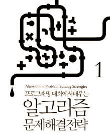

# Algorithm
- 참고도서  

- 문제 1  
    * 3n + 1 문제
    * 두개를 입력받아 두개의 사이값 중 수열을 만들고 그 수열의 사이클중 가장 큰 값을 찾아내는 문제이다.   
    * 수열만드는 방법 : 어떤수의 값이 짝수면 2로 나누고 홀수면 3을 곱한다음 1을 더한다. 맨마지막수가 1이 될때까지 반복하며, 반복된수의 횟수는 사이클아라고 부른다.      
    * 입력
        1 10
    * 출력
        20

- 문제 2  
    * 지뢰찾기 문제 
    * 별표는 지뢰이며, .는 없는 표시다.
    * 입력 
        4 3 
        *...
        ....
        .*..
    * 출력
        *100
        2210
        1*10